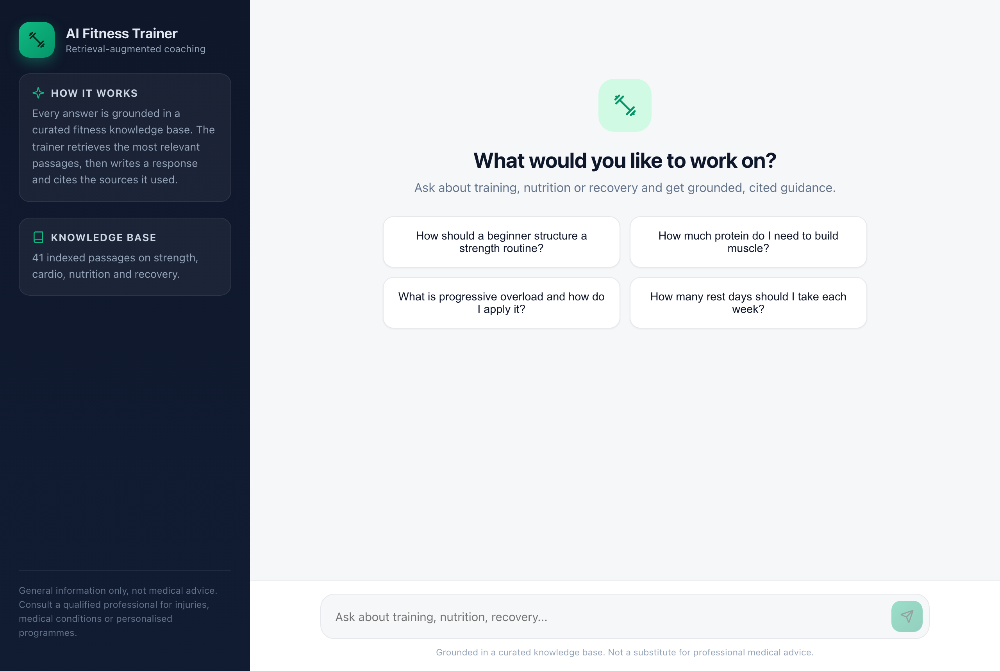
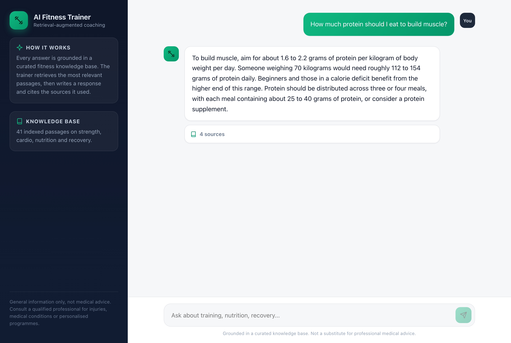
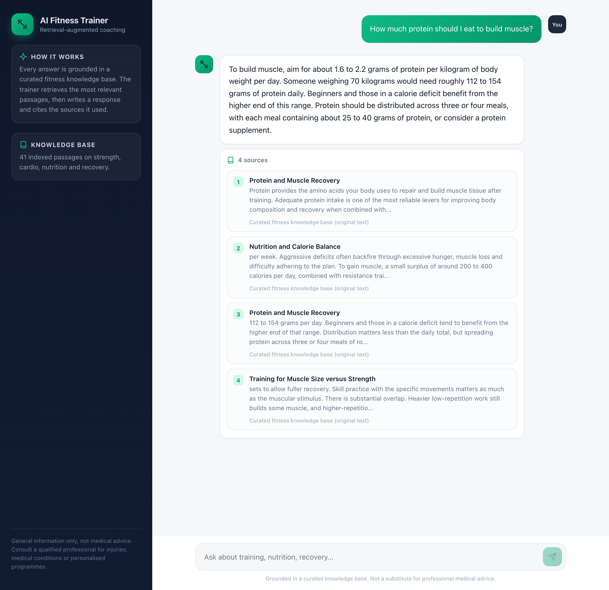

# AI Fitness Trainer with RAG

> **Work in progress.** This is an early, usable baseline: the full retrieval-augmented
> generation pipeline, a streaming chat API and a polished web interface all work end to end
> on a local machine with no paid services. It is being actively developed, and the roadmap in
> [Future work](#future-work) lists what is planned next.

A fitness assistant built on a Retrieval-Augmented Generation (RAG) approach. Rather than relying
on a language model's memory alone, it grounds every answer in a curated fitness knowledge base and
shows the passages each answer was drawn from, so guidance on training, nutrition and recovery is
tied to consistent, inspectable source material.

The whole stack is TypeScript: a Fastify backend running the RAG pipeline, sentence-transformer
embeddings computed in-process with Transformers.js, and a React frontend for a streaming chat
experience. It runs entirely offline against a local model through [Ollama](https://ollama.com),
and can point at any OpenAI-compatible endpoint instead.

## Screenshots

Home screen with suggested prompts:



A grounded answer, streamed token by token:



The same answer with its retrieved sources expanded:



## Features

- Hybrid retrieval combining dense sentence-transformer embeddings with a BM25 lexical index,
  fused using reciprocal rank fusion, so both semantic and exact-term matches contribute.
- Answers grounded in a curated, self-authored knowledge base on strength, cardio, nutrition and
  recovery, with the retrieved sources surfaced alongside every response.
- Streaming responses over a newline-delimited JSON API, rendered token by token in the UI.
- Provider-agnostic language model client: a local Ollama model by default, or any
  OpenAI-compatible endpoint (Groq, Google Gemini and others) configured through environment
  variables.
- In-process embeddings via Transformers.js, so there is no Python, GPU or separate embedding
  service to run.
- A clear "general information, not medical advice" disclaimer throughout.
- A test suite covering chunking, retrieval, the RAG pipeline and the HTTP API, with a
  deterministic fake model so tests need no network.

## Architecture

```
                 +---------------------------+
   Question ---> |        React web UI       |  streaming chat, source cards
                 +-------------+-------------+
                               | POST /api/chat (NDJSON stream)
                               v
                 +---------------------------+
                 |      Fastify backend      |
                 |                           |
                 |   RAG pipeline            |
                 |   1. Hybrid retrieval     |---> dense embeddings (Transformers.js)
                 |      (dense + BM25, RRF)  |---> BM25 lexical index
                 |   2. Prompt assembly      |
                 |   3. Grounded generation  |---> OpenAI-compatible LLM (Ollama by default)
                 +---------------------------+
                               ^
                               | build:index (offline)
                 +---------------------------+
                 |  Markdown knowledge base  |
                 +---------------------------+
```

The knowledge base is chunked and embedded once by an offline build step into a single index file.
At request time the pipeline retrieves the most relevant chunks, assembles a grounded prompt, and
streams the model's answer back with the sources it used.

## Tech stack

- Language: TypeScript throughout.
- Backend: Node.js, Fastify.
- Embeddings: Transformers.js (`@huggingface/transformers`) running `all-MiniLM-L6-v2` on CPU.
- Retrieval: custom BM25 and dense cosine search fused with reciprocal rank fusion.
- Language model: any OpenAI-compatible endpoint via the `openai` SDK, defaulting to Ollama.
- Frontend: React with Vite.
- Testing: Vitest.

## Getting started

### Prerequisites

- Node.js 20 or newer.
- [Ollama](https://ollama.com) for the default local model (free). After installing:

  ```bash
  ollama pull qwen2.5:1.5b
  ```

  Any OpenAI-compatible endpoint can be used instead; see [Configuration](#configuration).

### Install and build

```bash
git clone https://github.com/Omith786/AI-Fitness-Trainer-with-RAG.git
cd AI-Fitness-Trainer-with-RAG

npm install          # installs backend and web dependencies
npm run build:index  # embeds the knowledge base (downloads the embedding model once)
npm run build:web    # builds the frontend
npm start            # serves the app at http://127.0.0.1:8080
```

Open http://127.0.0.1:8080 and start asking questions.

### Development

Run the backend and the Vite dev server in two terminals for hot reload:

```bash
npm run dev:server   # Fastify on :8080
npm run dev:web      # Vite dev server on :5173, proxies /api to the backend
```

The frontend is then available at http://127.0.0.1:5173.

## Configuration

All configuration is through environment variables (see `.env.example`). The defaults run fully
offline against Ollama, so no configuration is required. Key variables:

| Variable | Default | Purpose |
| --- | --- | --- |
| `PORT` | `8080` | HTTP port. |
| `LLM_BASE_URL` | `http://localhost:11434/v1` | OpenAI-compatible endpoint. |
| `LLM_API_KEY` | `ollama` | API key for the endpoint (a placeholder for Ollama). |
| `LLM_MODEL` | `qwen2.5:1.5b` | Model name. |
| `EMBEDDING_MODEL` | `Xenova/all-MiniLM-L6-v2` | Transformers.js embedding model. |
| `RETRIEVAL_TOP_K` | `4` | Chunks passed to the model as context. |
| `CHUNK_SIZE` / `CHUNK_OVERLAP` | `700` / `120` | Chunking parameters (rebuild the index after changing). |

To use a hosted free-tier provider such as Groq or Google Gemini, set `LLM_BASE_URL`,
`LLM_API_KEY` and `LLM_MODEL` accordingly; commented examples are in `.env.example`.

## Usage

Ask questions in natural language, for example:

- "How should a complete beginner structure their first strength routine?"
- "How much protein do I need to build muscle?"
- "What is progressive overload and how do I apply it?"
- "How many rest days should I take each week?"

Each answer is generated from the retrieved passages, which you can expand under the response to
see exactly what the guidance was based on.

The API can also be called directly. It streams newline-delimited JSON events (`sources`, `token`,
`done`):

```bash
curl -N -X POST http://127.0.0.1:8080/api/chat \
  -H 'content-type: application/json' \
  -d '{"message": "How much protein should I eat to build muscle?"}'
```

## Extending the knowledge base

The knowledge base is a folder of Markdown files in `data/knowledge_base/`. Each file may include
optional front matter:

```markdown
---
title: My Topic
source: Curated fitness knowledge base (original text)
tags: [nutrition, recovery]
---

The document body...
```

Add or edit files, then rebuild the index:

```bash
npm run build:index
```

## Testing

```bash
npm test        # run the suite once
npm run typecheck
```

The tests use a deterministic fake model and a hashing embedder, so they run offline and require
neither Ollama nor the embedding model download.

## Project structure

```
.
├── src/                 # TypeScript backend
│   ├── server.ts        # server entry point
│   ├── app.ts           # Fastify app (routes, streaming)
│   ├── factory.ts       # wires the pipeline from config
│   ├── config.ts        # environment configuration
│   ├── rag/             # documents, chunking, embeddings, BM25, retriever, pipeline
│   ├── llm/             # OpenAI-compatible client and a test fake
│   └── index/build.ts   # offline index builder
├── web/                 # React + Vite frontend
│   └── src/             # App, components, streaming API client
├── data/knowledge_base/ # Markdown source documents
├── tests/               # Vitest suites
├── scripts/             # screenshot generation
└── docs/                # README screenshots
```

## Future work

This baseline is intentionally a starting point. Planned and possible extensions include:

- User profiles and goals, so advice can be tailored to experience level and objectives.
- Structured workout and meal planning built on top of the retrieved guidance.
- Progress tracking and, potentially, integration with data from wearable devices.
- Inline citation markers linked to the exact source passage.
- A larger, versioned knowledge base with clearer provenance for each document.
- Retrieval evaluation (recall and precision against a labelled question set) to measure and tune
  answer grounding.

## Disclaimer

This project provides general fitness and nutrition information only. It is not medical advice and
is not a substitute for a qualified healthcare professional. Anyone with a medical condition, an
injury, or other individual circumstances should seek personalised professional guidance.

## Licence

Released under the MIT Licence. See [LICENSE](LICENSE).
